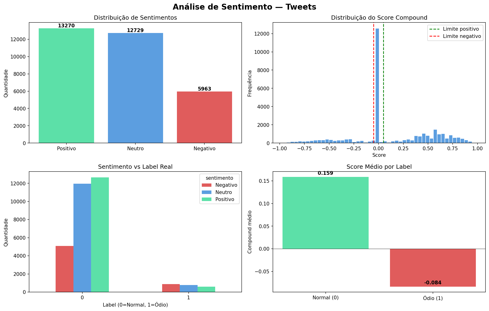

# 😊 Análise de Sentimento — Tweets

Classificação automática de sentimentos em tweets reais utilizando VADER, uma ferramenta de NLP especializada em textos de redes sociais. O projeto compara a classificação do modelo com os labels reais do dataset.

## Como foi feito

Os tweets foram processados pelo VADER (Valence Aware Dictionary and sEntiment Reasoner), que atribui um score compound de -1 a +1 para cada texto. Palavras irrelevantes como artigos e preposições (stopwords) são ignoradas na análise. A classificação final segue a regra:

| Score Compound | Sentimento |
|---|---|
| >= 0.05 | Positivo |
| <= -0.05 | Negativo |
| Entre -0.05 e 0.05 | Neutro |

## Base de dados

Dataset real de tweets com 31.962 registros, originalmente rotulado para detecção de discurso de ódio, com duas classes:

| Label | Descrição | Quantidade |
|---|---|---|
| 0 | Tweet normal | 29.720 |
| 1 | Discurso de ódio | 2.242 |

## O que os gráficos mostram

- **Distribuição de sentimentos** — 13.270 positivos, 12.729 neutros e 5.963 negativos detectados pelo VADER
- **Score compound** — concentração dos tweets próximos ao zero, com os limites de classificação marcados
- **Sentimento vs Label real** — comparação entre o que o VADER detectou e o gabarito original
- **Score médio por label** — tweets de discurso de ódio têm score médio mais negativo que tweets normais

## Tecnologias

- Python 3
- pandas — manipulação dos dados
- NLTK + VADER — análise de sentimento em linguagem natural
- matplotlib — visualização dos resultados

## Como rodar

1. Clique no badge **Open in Colab** acima
2. Vá em `Runtime > Run all`
3. Os downloads do NLTK são feitos automaticamente

## Resultado

